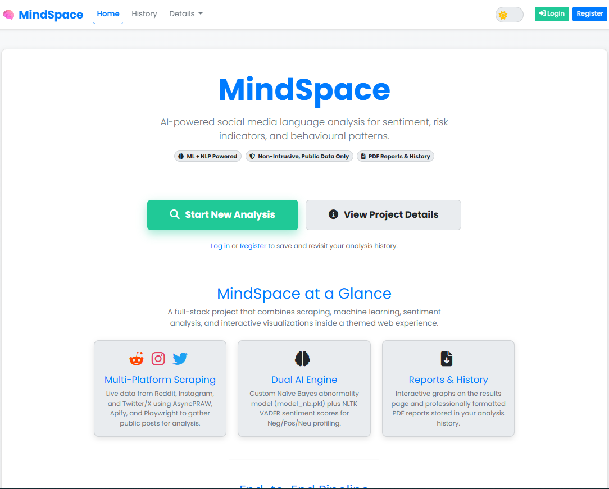
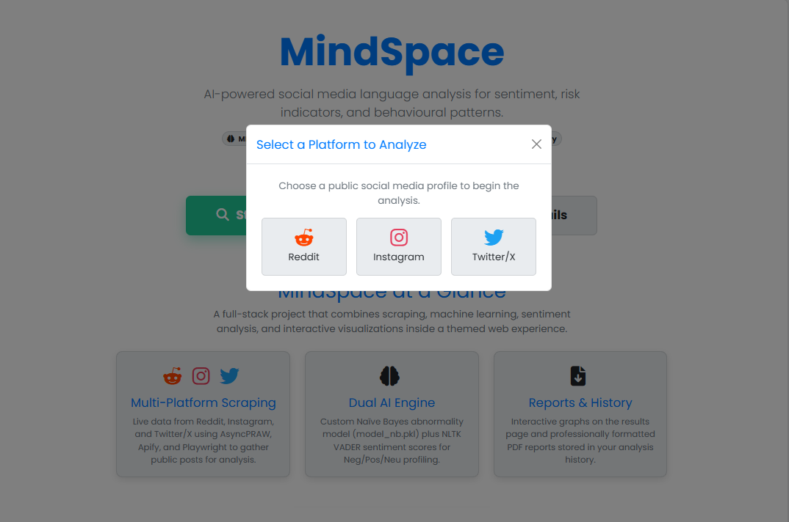
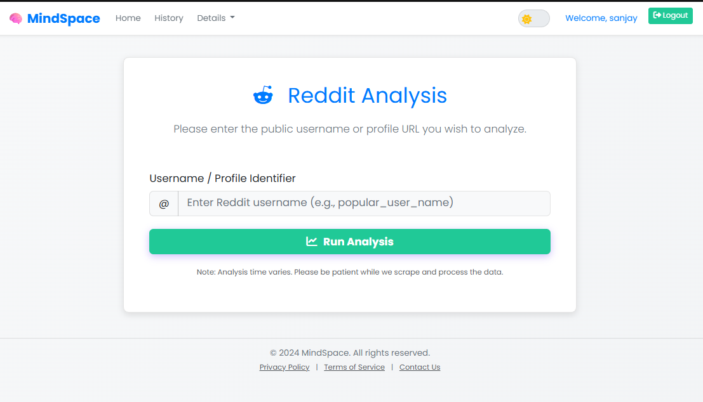
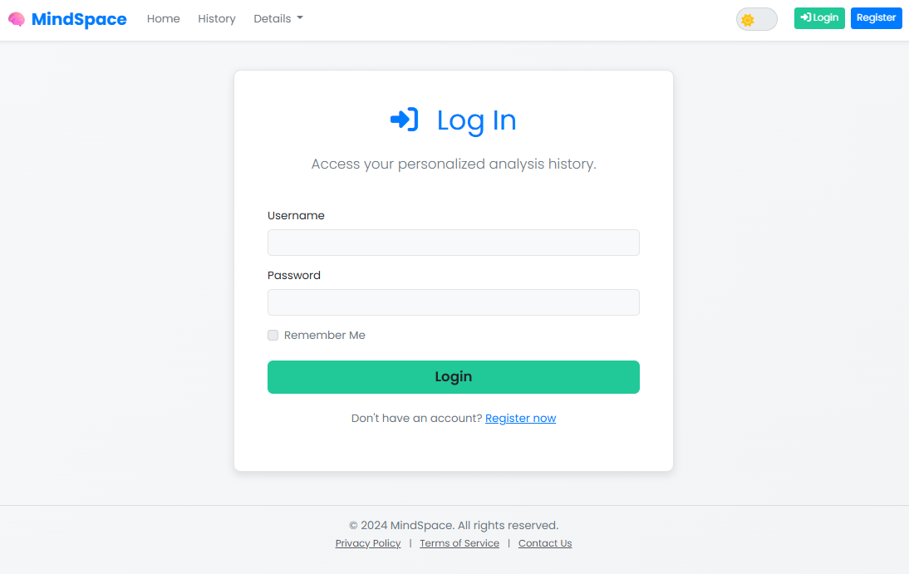
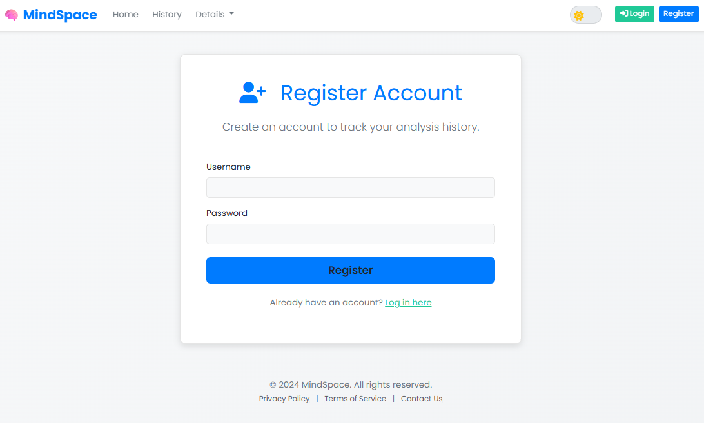
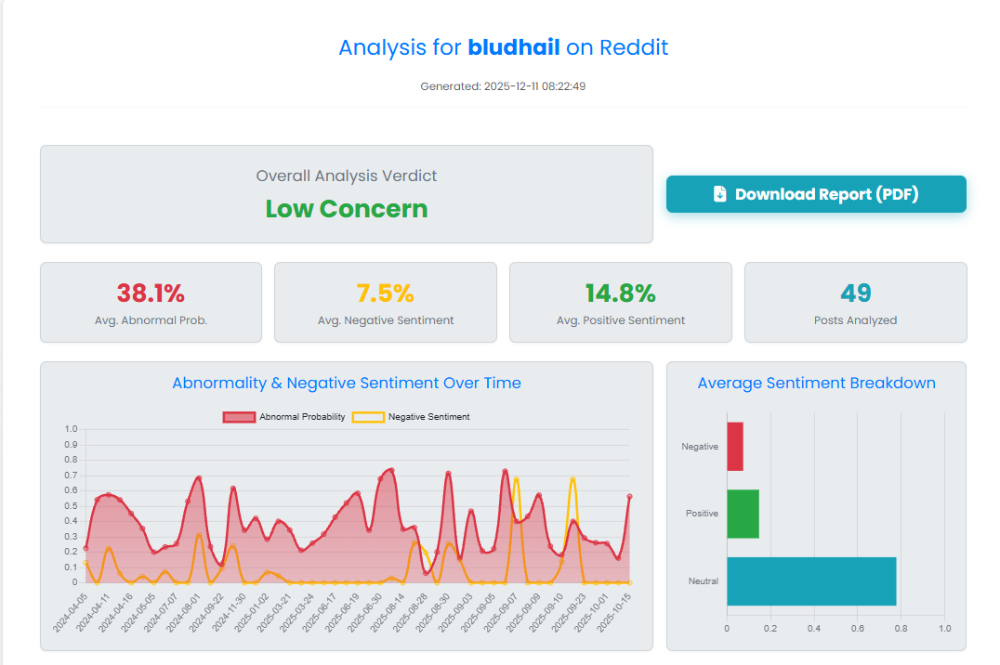
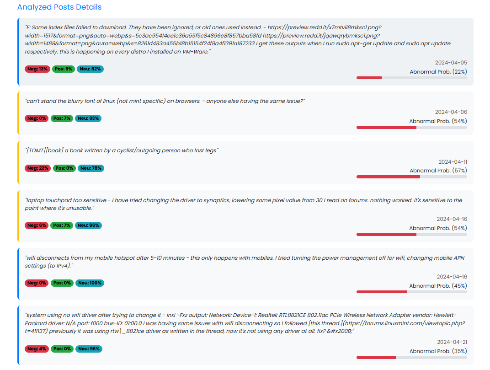
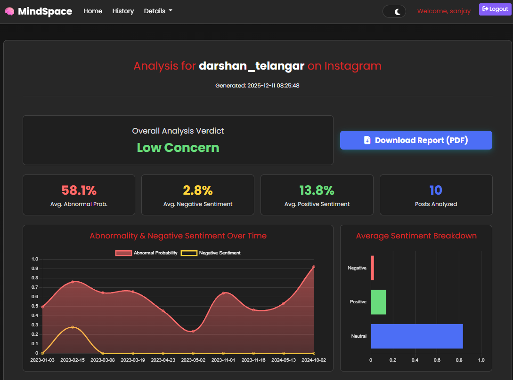
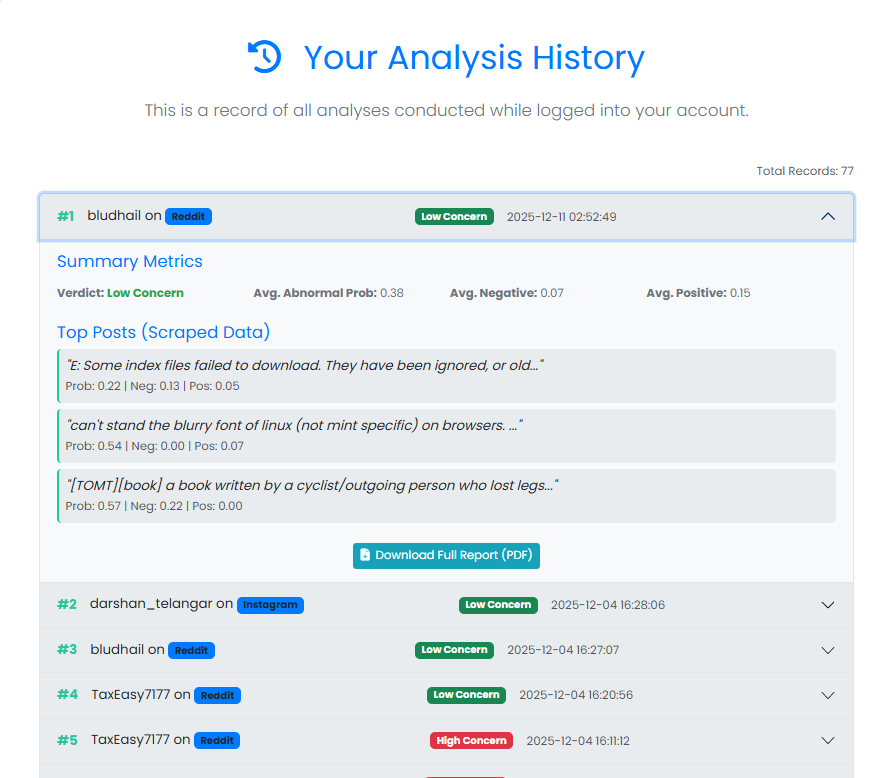
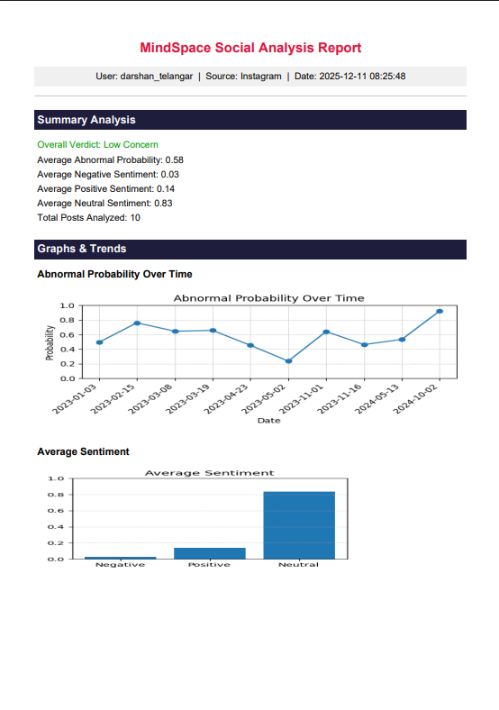

<h1>📸 Screenshots</h1>

---

<h2 align="center">1️⃣ Home Page — Start New Analysis</h2>
<p align="center">
  
</p>
<p align="center">Users land on the main interface and choose to start a new analysis.</p>

---

<h2 align="center">2️⃣ Platform Selection Modal</h2>
<p align="center">
  
</p>
<p align="center">User selects the platform: Reddit, Instagram, or Twitter/X.</p>

---

<h2 align="center">3️⃣ Enter Username / Profile URL</h2>
<p align="center">
  
</p>
<p align="center">User inputs a public profile ID for analysis.</p>

---

<h2 align="center">4️⃣ Login Page (Optional)</h2>
<p align="center">
  
</p>
<p align="center">Optional login for storing analysis history.</p>

---

<h2 align="center">5️⃣ Register Page</h2>
<p align="center">
  
</p>
<p align="center">Simple registration form for account creation.</p>

---
<h2 align="center">6️⃣Graph Insights — Sentiment & Abnormality Trends</h2>
<p align="center">
  
</p>
<p align="center">Visual trends over time for abnormality and negative sentiment.</p>

---

<h2 align="center">7️⃣ Per‑Post Detailed Sentiment & Abnormality Breakdown</h2>
<p align="center">
  
</p>
<p align="center">Each scraped post includes sentiment scores and abnormality probability.</p>

---
<h2 align="center">8️⃣ Dark Theme</h2>
<p align="center">
  
</p>
<p align="center">Full analysis summary showing verdict, average sentiment, abnormality %, and graphs.</p>


---

<h2 align="center">9️⃣ Analysis History Page</h2>
<p align="center">
  
</p>
<p align="center">List of all previous analyses with quick metrics and PDF download links.</p>

---

## 🔟 Generated PDF Report Preview

<p align="center">
  
</p>
<p align="center">Professional PDF generated summarizing the analysis with charts.</p>

---

# MindSpace

MindSpace is a full‑stack web application that analyzes public social media posts for abnormality (risk) indicators and sentiment. It uses a dual‑engine approach (custom Naïve Bayes abnormality model + NLTK VADER sentiment scores) to produce interactive charts, per‑post breakdowns, and downloadable PDF reports. Registered users can save and revisit analysis history.

---

# ✅ Key Features

**Platform & Scraping**

```
• Reddit, Instagram, Twitter/X scraping (public posts)  
• Platform selector modal for quick analysis
```

**Analysis & ML**

```
• Custom Naïve Bayes abnormality model (model_nb.pkl)  
• VADER sentiment (neg/pos/neu)  
• Per‑post probability + sentiment tags
```

**UI & Reports**

```
• Interactive time series & bar charts  
• Per‑post cards with sentiment chips  
• Downloadable, printable PDF reports  
• Light + Dark UI themes
```

**User & History**

```
• Registration & login  
• Saved analyses with thumbnails and PDF links  
• Timestamps and platform metadata
```

---

# 💻 Tech Stack

```
Frontend: HTML, Bootstrap, JS (charts via Chart.js / Matplotlib for PDFs)  
Backend: Python (Flask)  
ML: scikit‑learn (Naïve Bayes), NLTK VADER  
DB: PostgreSQL / SQLite  
PDF: Matplotlib + ReportLab  
Scraping: AsyncPRAW, Apify, Playwright (where applicable)
```

---

# ⚙️ Setup & Quick Start

```bash
git clone https://github.com/SanjayMarathi/MindSpace.git
cd MindSpace
python -m venv venv
# activate venv
source venv/bin/activate  # mac/linux
# or .\venv\Scripts\activate  # windows
pip install -r requirements.txt
python app.py  # or `flask run` depending on entrypoint
```

**Environment**: create a `.env` with keys for any third‑party scraping services and DB connection string.

---

# 🧭 Usage

1. Open the app in a browser.
2. Click **Start New Analysis** → choose platform → enter a public username/profile URL.
3. Wait for scraping and model processing — results page shows charts, per‑post cards and a PDF export button.
4. Register / log in to save the analysis to your history.

Example analysis URL:

```
http://127.0.0.1:5000/analyze?platform=reddit&user=example_user
```

---

# 📁 Project Structure

```
MindSpace/
├── app.py
├── requirements.txt
├── models/
│   └── model_nb.pkl
├── static/
├── templates/
│   ├── index.html
│   ├── results.html
│   ├── history.html
│   └── report_pdf.html
├── scrapers/
│   ├── reddit_scraper.py
│   ├── instagram_scraper.py
│   └── twitter_scraper.py
└── utils/
    ├── pdf_utils.py
    └── viz_utils.py
```

---

# 📝 Developer Notes

* Keep screenshots in `outputs/` for README rendering on GitHub.
* Place ML model files in `models/` and load them from the analysis pipeline.
* When deploying, ensure Matplotlib fonts are available to avoid PDF rendering issues.
* Respect platform scraping policies and rate limits — use official APIs where required.

---

# 🧑‍💻 Author

```
Sanjay Marathi
GitHub: https://github.com/SanjayMarathi
```

---
